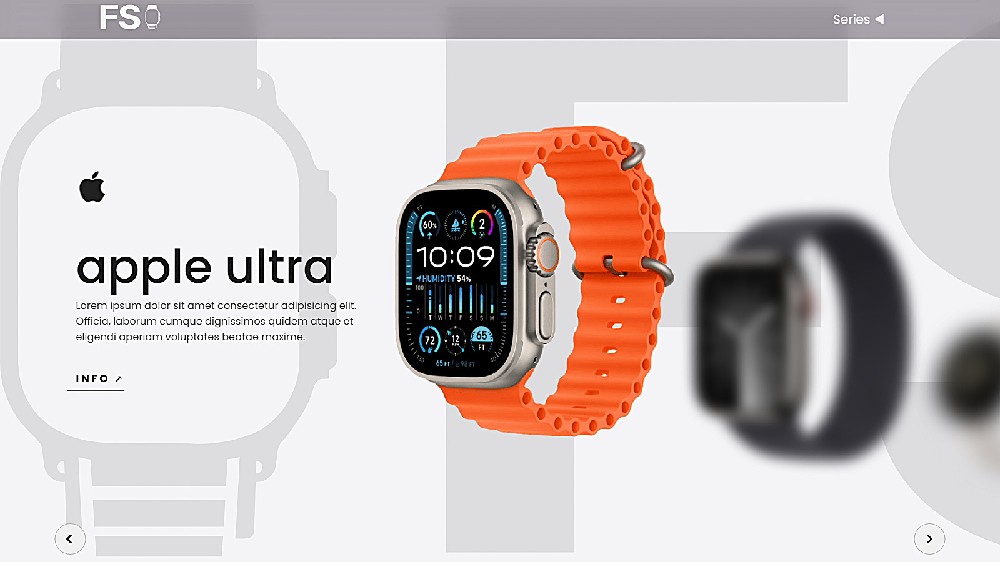

# 🌫️ Slider-blur

Proyecto de un **control deslizante de carrusel con efectos de desenfoque**, creado con HTML, CSS y JavaScript.  
Este slider combina transformaciones visuales y filtros CSS para lograr transiciones impactantes y modernas.

---

## ✨ Características

- 🎞️ **Carrusel de imágenes** con animaciones suaves
- 🌫️ **Efectos de desenfoque** aplicados durante las transiciones
- 🌀 Uso combinado de **transformaciones** y **filtros CSS**
- 📱 Diseño **totalmente responsivo**
- 🔘 Controles de navegación intuitivos

---

## 🛠️ Tecnologías utilizadas

- ⚙️ **HTML5** – estructura semántica del carrusel
- 🎨 **CSS3** – efectos visuales, filtros y animaciones
- 💡 **JavaScript** – control del slider, navegación y lógica de comportamiento

---

## 🚀 Experiencia de Usuario Mejorada

- Estética moderna con **transiciones elegantes y efectos visuales llamativos**
- Interfaz limpia y minimalista que favorece la atención en las imágenes
- Adaptado para todo tipo de pantallas y dispositivos
- Navegación fluida y controles accesibles

---

## 🎯 Objetivos del Proyecto

- Explorar las capacidades avanzadas de **CSS Filters** y **transformaciones**
- Mejorar el dominio de **JavaScript aplicado a interfaces dinámicas**
- Desarrollar un componente visualmente atractivo y reutilizable
- Fortalecer conocimientos en diseño responsivo y animaciones
- Crear una experiencia de usuario más rica y moderna en proyectos web

## 🖥️ Capturas de pantalla

## 

¡Un proyecto ideal para practicar y demostrar habilidades en diseño visual avanzado usando tecnologías del lado del cliente!
